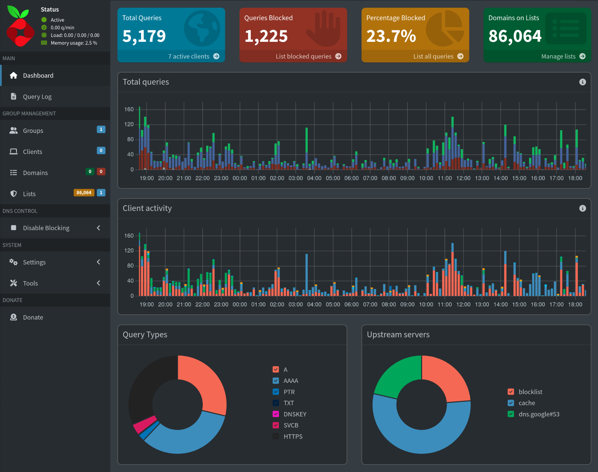

# Pi-Hole

## What is Pi-hole?
Pi-hole provides network-wide ad blocking and tracker protection 
for my home network, running on Ubuntu Server.

**Purpose:** Block ads/trackers at the DNS level before they reach devices

**Environment:**
- Hardware: Raspberry Pi 4 Model B, 8GB RAM
- OS: Ubuntu 24.04.3 LTS
- Network: <10 devices, router with limited DNS options

## Architecture
**Network Flow:**
```
┌──────────┐      ┌──────────┐      ┌──────────┐      ┌─────────────┐
│ Devices  │──────│  Router  │──────│ Pi-hole  │──────│ Google DNS  │
│          │      │  (DHCP)  │      │  (DNS)   │      │  8.8.8.8    │
└──────────┘      └──────────┘      └──────────┘      └─────────────┘
     |                  │                 │
     │                  │                 ├─ Checks blocklist
     │                  │                 ├─ Blocks if match ─ 0.0.0.0
     │                  │                 └─ Allows if safe ─ forward
     │                  │
     └──────────────────┘
      Gets IP from DHCP
```

**DNS Query Flow:**
1. Device requests `example.com`
2. Router forwards DNS query to Pi-hole
3. Pi-hole checks domain against blocklist
   - **Blocked domain** Returns `0.0.0.0` (ad never loads)
   - **Allowed domain** Forwards to Google DNS (8.8.8.8)
4. Response returns to device

**Key Components:**
- **Router:** DHCP server only
- **Pi-hole:** DNS server + ad blocker
- **Upstream DNS:** Google DNS (8.8.8.8, 8.8.4.4)

## Installation
- Updated system packages
- Installed pi-hole using the official documentation

### Dependency Installation Error
**Problem:** `Error: Unable to install Pi-hole dependency package.`

**Solution:**
- used `apt --fix-broken install` to fix anything that might cause the error
- rebooted after (among other things) the kernel got updated

## Configuration
- pi-hole requires a static IP address, which I configured by DHCP reservation through the router
- selected the default DNS provider (google)
- selected to include the default blocking list as a start

## Configuration Decisions

**Upstream DNS:** Initially selected Google (8.8.8.8); (default during setup)

*Future improvement:* Migrate to privacy-focused DNS (Cloudflare 1.1.1.1 or Quad9), or implement recursive DNS with Unbound for maximum privacy.

### Router Limitations
**Problem:** Limited router configuration options.
Router Model: Compal Modem CH7465LG-LC
No DNS configuration options, DHCP cannot be disabled

**Solution:**
Per-device DNS configuration, as I don't have to set up a lot of devices (<10).

*Future Improvements:*
- if the router gets replaced: set the pi-hole up as DHCP + DNS server
- I could also try another workaround if setting up devices occurs more than once, or starts becoming a nuisance:
    - set a static IP for the server that the pi-hole is running on
    - /etc/dhcpcd.conf -> `static ip_address=[IP/subnet]`
    - set the DHCP range of the router to exactly one, the pi-hole's, IP and then let the pi-hole do the DHCP and DNS

### Per Device Configuration
- Documented process for each OS (Linux/macOS/iOS/iPadOS/GoogleTV)
- Validated DNS resolution of other devices by checking pi-holes interface for the their IP addresses

#### Linux
1. Go to network settings
2. select the connection you want to configure
3. go to IPv4 and select "Automatic (only addresses)
4. type in the pi-hole's IP in the DNS field
5. select IPv6 and "Automatic (only addresses)" in the drop down menu
6. type in, or paste, the IPv6 address of the pi-hole in the DNS field
7. apply changes

#### Google TV
1. Go to Wifi settings
2. note which IP the TV has and reserve it in the DHCP settings of the router
3. look for "IP settings" or "DHCP settings"
4. set it from DHCP to static
5. the TV will ask for:
    - IP of the TV
    - the subnet
    - DNS 1
    - DNS 2
6. DNS 1: set this to the pi-hole's IP
7. DNS 2: set this to `0.0.0.0`; leaving it blank will cause the firmware of the TV to discard the settings you just made.
8. Check the network status and confirm that your pi-hole is indeed the TV's DNS server.
9. you can also check the pi-hole's web-interface for your TV's IP

#### macOS
1. Navigate to settings 
2. Network: select "Details" for the network you're connected to
3. DNS: select "+" and add in the IPv4 and IPv6 of your pi-hole server

#### iPadOS / iOS
1. Navigate to settings
2. Wifi - select connected Network
3. scroll down to "Configure DNS"
4. set to manual
5. delete previous servers
6. add pi-hole's IPv4 and IPv6
7. Verify in Settings -> Wifi -> (i) -> DNS section only shows pi-hole's IPs

## Verification & Testing

**Linux verification:**
```bash
resolvectl status
# Expected: DNS Servers: pi-hole's IP

# If incorrect, restart service and reconnect to network
sudo systemctl restart systemd-resolved
nmcli connection down Wired\ connection\ 1
nmcli connection up Wired\ connection\ 1
resolvectl status
# Status now correctly shows pi-hole's IP as DNS
``` 

### Challenge: Google TV DNS Configuration
**Problem:** Android TV had no obvious DNS settings in the UI

**Initial attempt:**
- found workaround for DNS configuration
- Configured DNS 1 (Pi-hole IP)
- Left DNS 2 blank per TV's instructions
- Settings would not save

**Root cause:** TV firmware discards all settings if DNS2 field is left empty

**Solution:**
1. Reserved TV's IP via router DHCP
2. Set TV to manual IP configuration, choosing a static IP instead of DHCP
3. Set DNS 2 to `0.0.0.0` (required to save settings)
4. Verified via pi-hole interface - TV's IP appeared along with query spike and increased blocking rate

**takeaway:** Always test and verify changes, even when following official docs

## Results

**Metrics (first 24 hours):**
- Total queries: 5179
- Blocked: 23.7% (1225 queries)
- Devices protected: 5
- Successfully blocking ads and trackers on configured devices



**Observable improvements:**
- faster page loads (no tracker loading delays)
- Reduced data usage (ads never downloaded)

## Maintenance
- Update pi-hole via `pihole -up`
- Check the pi-hole release notes on Github before updating
- Release notes can be found in the github repos:
    - Core
    - FTL
    - Web
- Monitor pi-hole via cli command `pihole status`, or via logging into the web-interface using `pi-hole-IP/admin`

## Lessons
- Routers matter: Verify your router has DNS and DHCP configuration options
- Firmware quirks (Google TV DNS 2 field) require testing, don't just trust its instructions blindly
- Don't give up if you don't find a DNS configuration tab immediately; You can sometimes still find a workaround to reach the desired result
- Per-device DNS is viable for small networks but doesn't scale

## Resources
- [The official pi-hole documentaton](https://docs.pi-hole.net/)
- [FAQ post regarding DNS configuration challenge](https://discourse.pi-hole.net/t/how-do-i-configure-my-devices-to-use-pi-hole-as-their-dns-server/245)
- [Pi-hole on Github](https://github.com/pi-hole)